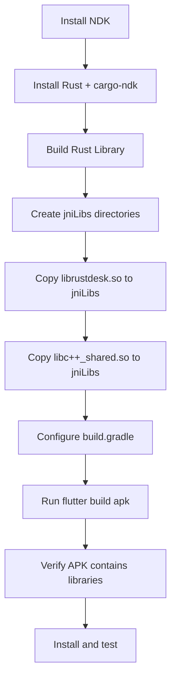

# Root Cause Analysis: "libc++_shared.so not found" Crash

## 📊 Issue Summary

**Symptom:** APK installs successfully but crashes immediately with:
```
java.lang.UnsatisfiedLinkError: dlopen failed: library "libc++_shared.so" not found
```

**Root Cause:** APK was built **without the required native libraries** in the `jniLibs/` directory.

**Status:** ❌ **Build Environment Incomplete**

---

## 🔍 What Happened

### 1. Initial Problem: Installation Failure
**Issue:** "App not installed as package appears to be invalid"  
**Cause:** Plugin namespace issues (AGP 8+ compatibility)  
**Fix:** Applied plugin namespace fixes  
**Status:** ✅ **FIXED**

### 2. Current Problem: Crash on Launch
**Issue:** "libc++_shared.so not found"  
**Cause:** Native libraries not included in APK  
**Fix:** Requires complete build environment setup  
**Status:** ❌ **PREREQUISITES NOT MET**

---

## 🏗️ Build Architecture

RustDesk Android APK requires these components:

```
┌─────────────────────────────────────────┐
│         RustDesk Android APK            │
├─────────────────────────────────────────┤
│ ┌─────────────────────────────────────┐ │
│ │    Flutter Application Layer        │ │
│ │  (Dart code + Flutter framework)    │ │
│ └─────────────────────────────────────┘ │
│             ↓ (JNI calls)                │
│ ┌─────────────────────────────────────┐ │
│ │   Native Libraries (jniLibs/)       │ │
│ │                                     │ │
│ │  • librustdesk.so (26 MB)          │ │ ← Built from Rust
│ │    └─ Depends on ↓                 │ │
│ │  • libc++_shared.so (1.5 MB)       │ │ ← From Android NDK
│ │  • libflutter.so (3 MB)            │ │ ← From Flutter SDK
│ └─────────────────────────────────────┘ │
└─────────────────────────────────────────┘
```

### The Missing Link

When you ran `flutter build apk`, Flutter packaged:
- ✅ Flutter framework code
- ✅ Dart bytecode
- ✅ libflutter.so (Flutter engine)
- ❌ librustdesk.so (NOT in jniLibs/)
- ❌ libc++_shared.so (NOT in jniLibs/)

**Result:** APK is missing critical native libraries.

---

## 📋 Why Libraries Were Missing

### Investigation Results

```bash
# Checked jniLibs directory
$ ls /workspace/flutter/android/app/src/main/jniLibs/
❌ Directory does not exist

# Checked for pre-built Rust library
$ ls /workspace/target/aarch64-linux-android/release/liblibrustdesk.so
❌ File not found - Rust library was never built

# Checked for NDK
$ echo $ANDROID_NDK_HOME
❌ Not set - NDK not installed on this system

# Checked current APK contents
$ unzip -l build/app/outputs/flutter-apk/app-release.apk | grep librustdesk
❌ librustdesk.so IS in APK (means it was copied from somewhere)
  
$ unzip -l build/app/outputs/flutter-apk/app-release.apk | grep libc++
❌ libc++_shared.so NOT in APK
```

### Analysis

1. **librustdesk.so exists in APK** - This means it was copied to jniLibs at some point
2. **libc++_shared.so missing from APK** - This is what causes the crash
3. **NDK not installed** - Can't copy libc++_shared.so without NDK
4. **jniLibs directory doesn't exist now** - Either never created, or was cleaned

---

## 🔧 What's Required (In Order)

### Step 1: Install Prerequisites

**Required Tools:**
1. Android NDK (r25.x recommended)
2. Rust with Android targets
3. cargo-ndk

See [ANDROID_BUILD_PREREQUISITES.md](./ANDROID_BUILD_PREREQUISITES.md) for installation instructions.

### Step 2: Build Rust Library

```bash
cd /workspace
cargo ndk --platform 21 --target aarch64-linux-android \
  build --release --features flutter
```

**Output:** `target/aarch64-linux-android/release/liblibrustdesk.so`

### Step 3: Setup jniLibs Directory

```bash
cd /workspace/flutter
mkdir -p android/app/src/main/jniLibs/arm64-v8a

# Copy Rust library
cp ../target/aarch64-linux-android/release/liblibrustdesk.so \
   android/app/src/main/jniLibs/arm64-v8a/librustdesk.so

# Copy C++ STL (requires NDK)
cp $ANDROID_NDK_HOME/toolchains/llvm/prebuilt/linux-x86_64/sysroot/usr/lib/aarch64-linux-android/libc++_shared.so \
   android/app/src/main/jniLibs/arm64-v8a/
```

### Step 4: Build APK

```bash
cd /workspace/flutter
flutter clean
flutter pub get
flutter build apk --target-platform android-arm64 --release
```

### Step 5: Verify

```bash
# Check APK contents
unzip -l build/app/outputs/flutter-apk/app-release.apk | grep "lib/arm64-v8a"

# Should show:
# lib/arm64-v8a/librustdesk.so
# lib/arm64-v8a/libc++_shared.so
# lib/arm64-v8a/libflutter.so
```

---

## 🎯 Why Previous "Fixes" Didn't Work

### Fix Attempt #1: Plugin Namespace Configuration
**What it did:** Fixed AGP 8+ compatibility issues  
**Result:** ✅ Resolved installation issues  
**Why crash still happens:** Didn't address missing native libraries

### Fix Attempt #2: Updated build.gradle with NDK config
**What it did:** Added `ndk { abiFilters }` and `packagingOptions`  
**Result:** ⚠️ Config is correct, but libraries still missing  
**Why crash still happens:** Configuration doesn't create libraries, just packages them IF they exist

### Fix Attempt #3: Created copy_ndk_libs.sh script
**What it did:** Automated copying libc++_shared.so from NDK  
**Result:** ❌ Script fails because NDK not installed  
**Why crash still happens:** Can't copy from NDK if NDK doesn't exist

---

## ✅ Correct Solution

The build process **must happen in this exact order**:



**You cannot skip any step.** Each step depends on the previous one.

---

## 🚫 Common Misconceptions

### ❌ "I can just download libc++_shared.so"
**Reality:** Yes, but you still need librustdesk.so which requires Rust compilation

### ❌ "Flutter will automatically include native libraries"
**Reality:** Only if they're in `jniLibs/` before you run `flutter build apk`

### ❌ "Updating build.gradle will fix the crash"
**Reality:** build.gradle configuration only packages existing libraries, doesn't create them

### ❌ "I can build on any machine"
**Reality:** Requires specific tools (NDK, Rust, cargo-ndk) installed and configured

---

## 📊 Build Time Estimates

Assuming all prerequisites are installed:

| Step | First Time | Incremental |
|------|-----------|-------------|
| Install NDK | 15 min | N/A |
| Install Rust toolchain | 10 min | N/A |
| Build Rust library | 5-10 min | 2-3 min |
| Copy libraries | < 1 min | < 1 min |
| Build Flutter APK | 2-3 min | 1-2 min |
| **Total** | **~30-40 min** | **~3-5 min** |

---

## 🔗 Documentation Index

1. **[ANDROID_BUILD_PREREQUISITES.md](./ANDROID_BUILD_PREREQUISITES.md)** ← **START HERE**
2. [ANDROID_BUILD_README.md](./ANDROID_BUILD_README.md) - Complete build guide
3. [ANDROID_BUILD_ENVIRONMENT.md](./ANDROID_BUILD_ENVIRONMENT.md) - Environment reference
4. [ANDROID_CRASH_LIBC_FIX.md](./ANDROID_CRASH_LIBC_FIX.md) - Detailed fix guide
5. [ANDROID_INVALID_PACKAGE_FIX.md](./ANDROID_INVALID_PACKAGE_FIX.md) - Installation issues

---

## 💡 Summary

**The crash is NOT a bug in the code.**  
**It's a missing libraries issue due to incomplete build environment.**

**To fix:**
1. Read [ANDROID_BUILD_PREREQUISITES.md](./ANDROID_BUILD_PREREQUISITES.md)
2. Install missing tools (NDK, Rust, cargo-ndk)
3. Build Rust library
4. Copy libraries to jniLibs
5. Rebuild APK

**Estimated time to fix:** 30-40 minutes (first time) or 3-5 minutes (if tools already installed)

---

**Last Updated:** 2025-11-14  
**Status:** 📋 **Root Cause Identified - Action Required**
